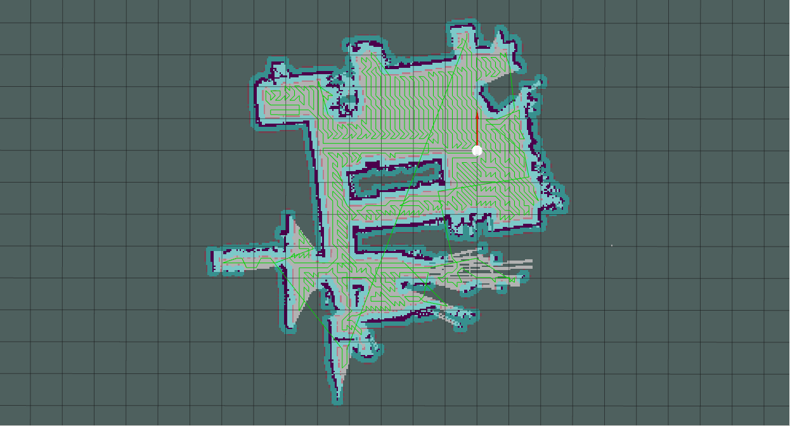
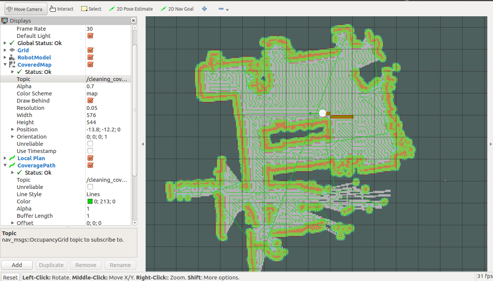

# cleaning-robot
- Using opencv and costmap2d to make cleaning plan. 
- Using movebase to contral robot's movement.
- Caution,  I just cost one week to search this work, so it still need much more work if you want to make it runs better.
- The env of this code is Ubuntu14.04, ros_indigo, opencv2. ubuntu16.04-ros-kinetic also test passed.

### Depends
- rbx1 <https://github.com/pirobot/rbx1/tree/kinetic-devel-beta>
- opencv
- ros-navigation-stack(actionlib、move-base...)
- roscpp、 tf
- **NO NEED TO INSTALL THEM ONE BY ONE**, I have put the install scripts in next **'Build'** step.

### Build
1. Download 'build.sh' in this repo.
2. ```export ROOT_WS='your absolute root work space path'```
3. ```sh build.sh```

### Run path planning node
```roslaunch cleaning_robot path_planning.launch```
(click left menu of CoveragePath to select corresponding topic to show path in mainwindow.)



### Run cleaning with movebase node
```roslaunch cleaning_robot  cleaning_movebase.launch```
(click left menu of CoverageMap to select corresponding topic to show covered grids in mainwindow.)


